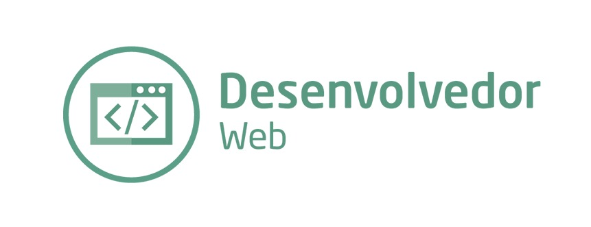

# Desenvolvedor Web

<b>Web</b> => Significa rede 
<b>Algorítimos</b> => É um passo a passo de uma instrução. Ex: Para fazer café é preciso ter o `pó`, `açucar`, `água`, `cafeteira`, `coador`, `colher` e `energia` para ligar a cafeteira. Cada ítem desses em conjunto formam um algorítimo.  
<b>Lógica de programação</b> => É uma sequência de instruções(algorítimo), geralmemte em uma ordem. Ex: de 01 a 10. Deve-se iniciar do 01 e continuar em ordem até chegar no passo 10, sem pular etapas. Outro ex: é o de fazer café, se envertermos qualquer um dos ítens ao fazer o café, gera um problema como por exemplo - colocar o `pó` para ferver no lugar da `água`. Qualquer ordem errada gera os famosos bug em qualquer aplicação. 

